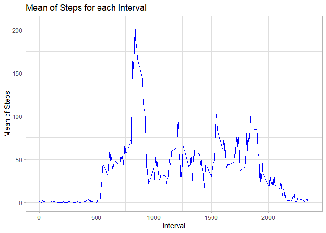

```r
knitr::opts_chunk$set(echo=TRUE, message = FALSE)
```


## Loading and preprocessing the data


```r
library(tidyverse)
library(lubridate)
library(ggplot2)
library(data.table)

df <- read_csv("activity.zip")

glimpse(df)
```

```
## Observations: 17,568
## Variables: 3
## $ steps    <dbl> NA, NA, NA, NA, NA, NA, NA, NA, NA, NA, NA, NA, NA, NA, NA...
## $ date     <date> 2012-10-01, 2012-10-01, 2012-10-01, 2012-10-01, 2012-10-0...
## $ interval <dbl> 0, 5, 10, 15, 20, 25, 30, 35, 40, 45, 50, 55, 100, 105, 11...
```

```r
df_totday <- df %>% 
    select(-interval) %>% 
    group_by(date) %>% 
    summarize_all(sum) %>% 
    ungroup() %>% 
    as.data.frame() %>% 
    na.omit()

df_meaninterval <- df %>% 
    select(-date) %>% 
    group_by(interval) %>% 
    summarize_all(mean, na.rm=TRUE) %>% 
    ungroup() %>% 
    as.data.frame()
```

## What is mean total number of steps taken per day?


```r
ggplot(df_totday) + 
    geom_histogram(mapping = aes(x = steps), fill="darkorange") +
    theme_light() + 
    scale_y_continuous(breaks = c(0:10)) + 
    labs(title = "Daily Steps", x = "Number of Steps", y = "Frequency")
```

<!-- -->

The median and mean of the total number of steps taken per day:


```r
stat1 <- summary(df_totday)[3:4,2]

summary(df_totday)[3:4,2]
```

```
##                                     
## "Median :10765  " "Mean   :10766  "
```

## What is the average daily activity pattern?


```r
ggplot(df_meaninterval,mapping = aes(x = interval, y= steps)) +
    geom_line(col="blue") +
    theme_light() + 
    labs(title = "Mean of Steps for each Interval", x = "Interval", y = "Mean of Steps")
```

<!-- -->

The 5-minute interval, on average across all the days in the dataset, that contains the maximum number of steps is


```r
df_meaninterval[df_meaninterval$steps==max(df_meaninterval$steps),"interval"]
```

```
## [1] 835
```

## Imputing missing values

Total number of row that are "NA":

```r
df %>% subset(is.na(steps)) %>% nrow()
```

```
## [1] 2304
```

Creation of a data frame with only the "NA" and fill it with the mean value of steps of the interval: 

```r
df_fillNA <- df %>% subset(is.na(steps)) %>% inner_join(df_meaninterval, by=c("interval"="interval")) %>% select(steps=steps.y, date, interval)
```

Create a new dataset that is equal to the original dataset but with the missing data filled in:


```r
df_complete <- bind_rows(df_fillNA, df %>% subset(!is.na(steps)))

glimpse(df_complete)
```

```
## Observations: 17,568
## Variables: 3
## $ steps    <dbl> 1.7169811, 0.3396226, 0.1320755, 0.1509434, 0.0754717, 2.0...
## $ date     <date> 2012-10-01, 2012-10-01, 2012-10-01, 2012-10-01, 2012-10-0...
## $ interval <dbl> 0, 5, 10, 15, 20, 25, 30, 35, 40, 45, 50, 55, 100, 105, 11...
```
Histogram of the new dataframe:

```r
df_totday_complete<- df_complete %>% 
    select(-interval) %>% 
    group_by(date) %>% 
    summarize_all(sum) %>% 
    ungroup() %>% 
    as.data.frame() %>% 
    na.omit() 

ggplot(df_totday_complete) + 
    geom_histogram(mapping = aes(x = steps), fill="darkorange") +
    theme_light() + 
    scale_y_continuous(breaks = c(0:12)) + 
    labs(title = "Daily Steps", x = "Number of Steps", y = "Frequency")
```

<!-- -->

the histogram for the new data frame is more high in the mean value.

The median and mean of the total number of steps taken per day in the new data frame:


```r
summary(df_totday_complete)[3:4,2]
```

```
##                                     
## "Median :10766  " "Mean   :10766  "
```

now the value of the median and the mean are the same, for the first data frame they are different ( *Median :10765  , Mean   :10766  * ), the median is lower.

## Are there differences in activity patterns between weekdays and weekends?

Create a new factor variable in the dataset with two levels – “weekday” and “weekend” indicating whether a given date is a weekday or weekend day

```r
df$daytype <- weekdays(df$date, abbreviate = TRUE)

df[grepl("lun|mar|mer|gio|ven", df$daytype), "daytype"] <- "weekday"
df[grepl("sab|dom", df$daytype), "daytype"] <- "weekends"


glimpse(df)
```

```
## Observations: 17,568
## Variables: 4
## $ steps    <dbl> NA, NA, NA, NA, NA, NA, NA, NA, NA, NA, NA, NA, NA, NA, NA...
## $ date     <date> 2012-10-01, 2012-10-01, 2012-10-01, 2012-10-01, 2012-10-0...
## $ interval <dbl> 0, 5, 10, 15, 20, 25, 30, 35, 40, 45, 50, 55, 100, 105, 11...
## $ daytype  <chr> "weekday", "weekday", "weekday", "weekday", "weekday", "we...
```


```r
df_meaninterval_daytype <- df %>% 
    select(-date) %>% 
    group_by(interval, daytype) %>% 
    summarize_all(mean, na.rm=TRUE) %>% 
    ungroup() %>% 
    as.data.frame()

ggplot(df_meaninterval_daytype , aes(x = interval , y = steps, color=daytype)) +
    geom_line() +
    theme_light() + 
    labs(title = "Mean of Steps for each Interval (by daytype)", x = "Interval", y = "Mean of Steps") +
    facet_wrap(~daytype , ncol = 1, nrow=2)
```

<!-- -->
